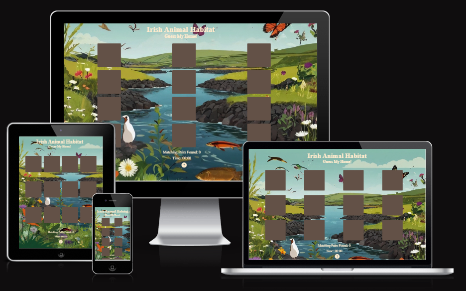

# Irish Animal Habitat
## Irish Animal Habitat is an online memory card game where the user matches the animal to there habitat. The aim of the game is to help children engage with nature and Irelands unique biodiversity. It also provides a form of cognitive training where the user has to remember where the cards are positioned in the game.

### PP2 - Gary Broderick

------------------------------------------------------------------------------------
## [**Live Site**](https://gbroder24.github.io/irish-animal-habitat/)

## [**Repository**](https://github.com/gbroder24/irish-animal-habitat.git)

## Table of Contents

[ UX / UI ](#uxui)  
+ [ Target Audience ](#target-audience)  
+ [ User Stories ](#user-stories)  
	* [ Client Goals ](#client-goals)  
	* [ User Goals ](#user-goals)   
+ [ Wireframes ](#wireframes)  
	* [ Landing Page ](#landing-page)  
	* [ Techniques Page ](#techniques-page)  
	* [ Signup Page ](#signup-page)   
+ [ Color Palette ](#color-palette)  
+ [ Font Styles ](#font-styles)  
+ [ Accessibility ](#accessibility)  

[ List of Features ](#list-of-features)    
+ [ Header ](#header)  
+ [ Hero Image ](#hero-image)  
+ [ The Benefits ](#the-benefits)  
+ [ Paralax Image ](#paralax-image)  
+ [ Timetable ](#timetable)  
+ [ Footer ](#footer)
+ [ Techniques Page ](techniques-page-1)  
+ [ Signup Page ](signup-page-1)  

[ Future-Features ](#future-features)  
+ [ Techniques Page ](#techniques-page-2)  
+ [ Signup Page ](#signup-page-2)  
+ [ User Account ](#user-account)  
+ [ Error Page ](#error-page)  

[ Tools and Technologies ](#tools-and-technologies)   

[ Testing ](#testing)  
+ [ Website Links ](#website-links)  
+ [ Signup Form ](#signup-form)  
+ [ User Testing ](#user-testing)  
+ [ Responsive Testing ](#responsive-testing)  

[ Lighthouse Testing ](#lighthouse-testing)    
+ [ Google Chrome ](#google-chrome)  
	* [ index.html ](#indexhtml)  
	* [ techniques.html ](#techniqueshtml)  
	* [ signup.html ](#signuphtml)  
+ [ Microsoft Edge ](#microsoft-edge)  
	* [ index.html ](#indexhtml-1)  
	* [ techniques.html ](#techniqueshtml-1)  
	* [ signup.html ](#signuphtml-1)  

 [ HTML Validation ](#html-validation)  
+ [ index.html ](#indexhtml-2)  
+ [ techniques.html ](#techniqueshtml-2)  
+ [ signup.html ](#signuphtml-2)  

[ CSS Validation ](#css-validation)    
+ [ style.css ](#stylecss)  

[ Known Bugs ](#known-bugs)   

[ Deployment](#deployment) 
+ [ Cloning and Forking ](#cloning-and-forking)  
+ [ Local ](#local)  
+ [ Remote ](#remote)  

[ Credits](#credits)  
+ [ Images ](#images)  
+ [ Embedded Videos ](#embedded-videos)  
+ [ Map ](#map)  
+ [ Content and Resources ](#content--resources)  
+ [ Readme ](#readme)  
+ [ Acknowledgements ](#acknowledgements)  

## UX/UI

### Target Audience

The target audience of the website is to attract young children and to help them engage with nature and Irelands unique biodiversity. Hopefully it also inspires young children to investigate and explore Irelands wild nature. This is a game that entertains and educates young children.

## User Stories

### Client Goals

I want to provide an online game that highlights and raises awareness about Irelands unique biodiversity.
I want to provide entertainment that sharpens the users memory.
I want young children to explore and engage with Irelands unique biodiversity.

### User Goals

I want to engage and explore Irelands unique biodiversity.
I want to play an entertaining and educational game about Irish animals and their habitats.
I want to improve my memory.

### Wireframes
The wireframe mockups were created on Balsamiq. They show what the website would look like on mobile and desktop devices.

Color Palette
The following colors were chosen for the website and ensure contrast is achieved in the main parts of the page.

#1f1e1e - Eerie Black - Used in the generic body, social media icons, submit and reset button hover effect.
#141313 - Chinese Black - Used in headings, hero cover text headings.
#ffffff - White - Used in the header, nav bar, signup form and map, text input hover, submit and reset button hover effect.
rgba(100, 105, 150, 0.7) - Used in the overlay on the hero image.
#fafafa - Lotion - Used in the timetable text, submit and reset button background-color.
rgba(0, 0, 0, 0.7) - Used in the timetable background image.
#030308 - Rich Black - Used for the fieldsets, signup form and map headings, form text input areas.
rgba(52, 59, 61, 0.6) - Used in the signup form and map.
Black - Used in the submit and reset button text.
Blue - Used in the social media icons hover effect.
Font Styles
The Sintony font style is the main font style used throughout the website and sans-serif is chosen as the fallback style.

Accessibility
The website avoids clutter.
The content is structured with semantic tags.
Aria labels and alt attributes are used for screen readers for the visually impaired.
The color scheme was chosen for sufficient contrast and legibility.
External links open in a new tab.
Embedded videos do not auto-play.
List of Features
Header
On tablet / desktop the header includes navigation links to the home page (index.html) techniques page and the signup page. It also has a logo included that when clicked on navigates to the home landing page.

As the user scrolls down the page the header is fixed to the top of the website for visibility and easy navigation.

A border line is displayed underneath an active page and this feature is indicated to the user. This feature is included across all pages.

On mobile devices the header includes the logo and a navigation bars icon (burger icon). When the navigation icon is selected a drop-down menu is displayed with a list of navigation links. This is consistent across all the pages.

header-image

header-mobile-image

Hero Image
The hero image attracts the user and indicates that body and mind is a calm and relaxing environment. It also informs the user with text overlay of the tag line and the location. There is also a call to action button. When selected it will navigate to the signup form.

hero-image

The Benefits
The benefits section describes the advantages of body and mind classes that the client specializes in. The content is responsive and engages the user, The content is kept short and precise so as not to overload the user with information. An image is also displayed that indicates calmness and relaxation to the user.

benefits-image

benefits-mobile-image

Paralax Image
The paralax image is a scrolling feature where the background content is scrolled at a different speed to the foreground content. It displays an image of a body and mind group class with yoga mats.

paralax-image

Timetable
The time table is located below the paralax image and above the footer. It informs the user of the times when the classes commence, the days and the type of class. There is also a background image of the river Shannon which corresponds to the location of the business and Limerick area. It has a tile design. This feature is also responsive.

timetable-image

timetable-mobile-image

Footer
The footer includes social media icons that are links to the clients social media accounts for the user to further inform themselves if interested. The links open in a new tab.

footer-image

Techniques Page
The techniques page gives the user a high level overview of the techniques, practices and the different aspects of body and mind. It provides relaxing and calm images and videos with a box shadow for the user to interact with and inform the users curiosity and interest. This page is also responsive and has a stacked design where the content is stacked on top of each section across various media devices.

techniques-page-image

techniques-image

techniques-video-image

Signup Page
Located underneath the header is an image of a woman relaxing and in a calm state to keep with the theme and flow of the website. Directly below this is a form for the user to book a session, to provide their details and send the client a message or a query. The user can also opt in to a newsletter. The signup form is user friendly and also has a hover effect when the cursor hovers over the input text areas, submit and clear buttons to attract the user to enter their details, submit their details or clear them.

signup-image

signup-form-image

Alongside the signup form is a map of the clients location for the user to easily locate and access the classes. On mobile the content is displayed in a stacked structure. This page is responsive across various media devices as well.

signup-map-image

signup-image

Future Features
Techniques Page
Implement a detailed profile on the client business owner about the skill set they possess, experience and qualifications.

Signup Page
Implement a calendar booking system so that the user can book a specific class on a specific day / month. Implement a 'class full' constraint on the booking system and have dates on the calendar blocked out informing the user of class availability.

User Account
Implement a User Account feature / page for returning customers so that they do not have to enter their details every time they return to the site.

Error Page
Implement a 404 error page in case there are any bugs that prevent the website or any links from working and the user can navigate back to the website.

Tools and Technologies
HTML5 Website Structure.
CSS3 Website Style.
MarkDown Readme.md file
Balsamiq Wireframes.
Github Repository and deployment.
Gitpod IDE.
Git Version control.
Fontawesom Icons.
W3schools HTML / CSS tips.
Google Fonts Font family.
Am I Responsive to show website on devices.
Pexels Images.
Image Resizer to rezize images.
Youtube for embedded videos.
Stack Edit for writing markdown language.
Testing
Test scenarios for the Body and Mind website were created by the Full Stack Software Developer (Gary Broderick). The website was manually tested, validated and results recorded. User testing (by family and friends) was also executed.

Website Links
The following test scenarios were executed on the websites links and results recorded:

Scenario	Result
Verify 'Techniques' link navigates to the correct page.	Pass
Verify 'Home' link navigates to the correct page.	Pass
Verify 'Signup' link navigates to the correct page.	Pass
Verify 'Body and Mind' logo link navigates to the correct page.	Pass
Verify 'Facebook' social media link navigates to the correct page.	Pass
Verify 'Twitter' social media link navigates to the correct page.	Pass
Verify 'Youtube' social media link navigates to the correct page.	Pass
Verify 'Instagram' social media link navigates to the correct page.	Pass
Signup Form
The following test scenarios were executed on the signup form and results recorded:

Scenario	Result
Do not fill in any details and select the 'Submit' button. Verify that the user is prompted to 'Please fill out this field' for 'First Name'.	Pass
Fill in 'First Name' details and select the 'Submit' button. Verify that the user is prompted to 'Please fill out this field' for 'Last Name'.	Pass
Fill in 'Last Name' details and select the 'Submit' button. Verify that the user is prompted to 'Please fill out this field' for 'Email Address'.	Pass
Fill in 'Email Address' details and exclude '@' symbol. Then select the 'Submit' button. Verify that the user is prompted to 'Please include an @ in the email address' for 'Email Address'.	Pass
Select 'Affirmation' or 'Visual' class radio button. Navigate away from the 'Signup' page. Now navigate to the 'Signup' page. Verify the 'Yoga' class radio button is selected.	Pass
Verify the 'User' can enter text into the text area to send the 'Client' a message.	Pass
Ensure the 'News Letter' option is unchecked. Navigate away from the 'Signup' page. Now navigate to the 'Signup' page. Verify the 'News Letter' checkbox is checked.	Pass
Populate all the required fields correctly and select the 'Submit' button. Verify that a new window / tab is displayed informing the 'User' that they have submitted their details successfully.	Pass
Populate all the required fields correctly and ensure the 'News Letter' option is unchecked. Select the 'Submit' button. Verify that 'News' has not been included in the sent data table for 'Input Name' column.	Pass
User Testing
The following test scenarios were executed on users and results recorded:

Scenario	Result
On the landing page scroll down and find out more about the website.	Pass
Navigate to the social media links.	Pass
Navigate to the 'Techniques' page and interact with the embedded videos.	Pass
Navigate to the 'Signup' page and fill in your details, email address, class and news letter preference.	Pass
Navigate to the 'Signup' page and locate class location.	Pass
Responsive Testing
The following test scenarios were executed on various media devices and results recorded:

Scenario	Result
Is the website responsive on mobile device screens.	Pass
Is the website responsive on desktop device screens.	Pass
mobile-responsive

desktop-responsive

Lighthouse Testing
All website pages were tested using the Lighthouse tool on a couple of different browsers, Chrome and Edge. The page load was analysed and Lighthouse reports and scores were generated.

The Best Practice score for the Techniques page and the Signup page scored 78. This score was due to the use of third party cookies. This score is acceptable because it is out of scope.

Google Chrome
index.html
chrome-lighthouse-index-image

techniques.html
chrome-lighthouse-techniques-image

chrome-lighthouse-best-practice-techniques-image

signup.html
chrome-lighthouse-signup-image

chrome-lighthouse-best-practice-signup-image

Microsoft Edge
index.html
edge-lighthouse-index-image

techniques.html
edge-lighthouse-techniques-image

edge-lighthouse-best-practice-techniques-image

signup.html
edge-lighthouse-signup-image

edge-lighthouse-best-practice-signup-image

HTML Validation
All html code was validated using the W3C Markup Validation Service.

index.html
validation-index.html-image

techniques.html
validation-techniques.html-image

signup.html
validation-signup.html-image

CSS Validation
All css code was validated using the W3C CSS Validation Service.

style.css
validation-style.css-image

validation-style.css-warning-image

Known Bugs
The following bug was discovered in the index.html file during Lighthouse testing:

bugs-image

The following line of code in the index.html file on Line #17 was causing the error:

<link rel="manifest" href="/site.webmanifest">
The fix and solution to this bug was to modify the line of code to the following:

<link rel="manifest" href="https://gbroder24.github.io/site.webmanifest" crossorigin="use-credentials">
Deployment
Cloning and Forking
Download the Gitpod extension for Chrome.
Once extension is installed a green Gitpod button will show up on the Github repo.
Click on the green Gitpod button and it will start up the workspace.
Local
Click on the green Code button in the repo.
Under the HTTPS tab clone using the web URL.
Copy the URL to clipboard and paste in the browser.
Remote
This website was deployed using GitHub pages. The steps to deploy are as follows:

Login to GitHub and navigate to the repository page (body-and-mind), click on the repository.
Once inside the repository, click on the "Settings" tab above the repository title.
Under "Code and automation" select "Pages" tab on the left side navigation menu.
In the "Build and Deployment" section (middle of the screen), under "Source" select from the drop-down menu "Deploy from a branch".
Under "Branch", select "main" branch and then "root" folder and click "save" button
The GitHub page site will be deployed.
It might take a few minutes to generate the "live" website link.

The live link to the website can be found here: Body and Mind.

Credits
Images
Hero Image

Benefits Image

Paralax Image

Timetable background image

Mindful Image

Breathwork Image

Visualisation Image

Signup Image

Embedded Videos
Yoga Video

Breath Focus

Visualisation Video

Map
Signup Map

Content & Resources
The design of the landing page was lead by the Love Running project.

The design of the techniques page was lead by the calm.com website.

The design of the signup page was lead by the Beach Yoga Fuerteventura project.

The tab icon was generated using favicon .

Typography researched on google fonts .

All other icons used are from Font Awesome

Code Institute for course / module content and portfolio project 1 scope.

Stack Overflow for the solution to the 404 syntax error.

W3schools for any queries or difficulties encountered with code concepts in html and css.

Flexbox Froggy for understanding the flexbox concept.

Readme
The Body and Mind readme mark down was inspired by the following:

Belfast Auto Repairs

Cross Stitch Art

Acknowledgements
My Mentor Alan Bushell for providing me with positive and encouraging feedback.
My Cohort Facilitator Amy Richardson for addressing any queries I had at weekly Standups.
