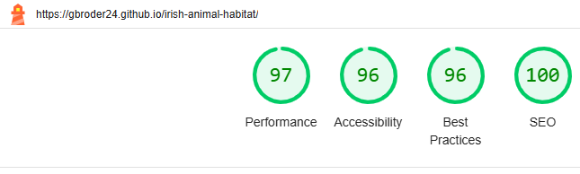

# Irish Animal Habitat
## Irish Animal Habitat is an online memory card game where the user matches the animal to their habitat. The aim of the game is to help children engage with nature and Irelands unique biodiversity. It also provides a form of cognitive training where the user has to remember where the cards are positioned in the game.

### PP2 - Gary Broderick

------------------------------------------------------------------------------------
## [**Live Site**](https://gbroder24.github.io/irish-animal-habitat/)

## [**Repository**](https://github.com/gbroder24/irish-animal-habitat.git)

## UX/UI

### Target Audience

The target audience of the website is to attract young children and to help them engage with nature and Irelands unique biodiversity. Hopefully it also inspires young children to investigate and explore Irelands wild nature. This is a game that entertains and educates young children.

## User Stories

### Client Goals

+ I want to provide an online game that highlights and raises awareness about Irelands unique biodiversity.  
+ I want to provide entertainment that sharpens the users memory.  
+ I want young children to explore and engage with Irelands unique biodiversity.  

### User Goals

+ I want to engage and explore Irelands unique biodiversity.  
+ I want to play an entertaining and educational game about Irish animals and their habitats.  
+ I want to improve my memory.  

### Wireframes
The wireframe mockups were created on Balsamiq. They show what the website would look like on mobile and desktop devices.

### Color Palette

The following colors were chosen for the website and ensure contrast is achieved in the main parts of the page.
+ blanchedalmond - Used in the generic body, headings and score area. It is a soft color and chosen so as not to distract the user from focusing on the game  
+ #635147 - Used as the color for the back of the cards. Earth tone color that styles nicely with the background image.   
+ #fefefe - Used as the background color of the modal.  
+ #888 - Used as the border color of the modal.  
+ green - Used in headings and paragragh content of the modal.  
+ Black - Used when the mouse moves over the modal buttons to draw the users attention with a hover effect.  
+ #fefefe - Used when the mouse moves over the modal buttons to draw the users attention to the buttons text with a hover effect.  

### Font Styles

The default font family has been used to style the website. This was chosen so that the it would not distract the users attention away fron focusing on the game.

### Accessibility

+ The website avoids clutter.  
+ The content is structured with semantic tags.  
+ Alt attributes are used for screen readers for the visually impaired.  
+ The color scheme was chosen for sufficient contrast and legibility.    

## List of Features

### The Background Image

The background image attracts the user and indicates that Irish Animal Habitat is a game about biodiversity and nature. It also engages the user and raises awareness of wildlife.

### The Headings

The headings inform the user that the game is called Irish Animal Habitat and the theme of the game is to match the animal to its habitat.

### The Game Area

The game area displays twelve cards in neat rows and columns. The cards lay face down with the back of the cards displayed to the user. When the user clicks on the first card the card flips from back to front displaying either an image of an animal or its habitat and stays in position. When the user clicks on the second card the card flips from back to front displaying either an image of an animal or its habitat. The first and second cards chosen stay in position facing the user if the animal is matched to its correct habitat. If they are not a match the cards will flip back to their inital state. When the website is initally loaded all the cards are shuffled. The shuffle functionality is displayed visually by having all the cards numbered 1 to 12. 

### The Score Area

The score area informs the user of their score. The inital score is integer number 0 which means that no matching pairs have been found. For each matching pair thereafter the score increments by an integer number of 1. The max score that any user can reach is a maximum score of integer number 6.

### The Congratulations Modal
When the user finds the last matching pair a congratulations modal is displayed informing the user that they have won the game. They have matched the animals with their correct habitat and found all six pairs. The modal also gives the user a choice of playing a new game or not. If the user chooses to play a new game the modal closes and a new game loads with all twelve cards shuffled. If the user chooses not to play another game the modal closes and a new game loads with all twelve cards shuffled for the next waiting player.

## Future Features

### A Timer

Implement a timer that automatically starts incrementing when the user clicks on the first chosen card. The timer automatically stops when the user finds the last matching card.

### User Modal

Implement a user modal which is displayed when the player wins the game.  
Implement an input area for the user to enter and submit their user name.  
Implement a score area to display the users score.  
Implement a time record area where the users time will be displayed.   

### Leaderboard Modal
Implement a leaderboard modal feature so that the user(s) can compare the time it took to complete the game and adds a competitive aspect to the game.  
Implement a leaderboard in local storage that records the score and time of the last ten to twenty users.

### Rate App
Implement a rate my app feature that kindly asks the user for feedback on the app e.g 5 stars out of 5 rating.

### Error Page
Implement a 404 error page in case there are any bugs that prevent the website or any links from working and the user can navigate back to the website.

## Tools and Technologies
+ HTML5 Website Structure.  
+ CSS3 Website Style. 
+ Javascript Website Logic.  
+ MarkDown Readme.md file  
+ [ Balsamiq ](https://balsamiq.com/wireframes/?gad_source=1&gclid=EAIaIQobChMI2N-YppndhQMV5pxQBh0uTQgmEAAYASACEgJUvPD_BwE) Wireframes.  
+ [ Github ](https://github.com/about) Repository and deployment.  
+ [ Gitpod ](https://www.gitpod.io/about) IDE.  
+ [ Git ](https://git-scm.com/about) Version control.  
+ [ Fontawesom ](https://fontawesome.com/) Icons.  
+ [ W3schools ](https://www.w3schools.com/) HTML / CSS / Javascript tips.   
+ [ Am I Responsive ](https://ui.dev/amiresponsive) to show website on devices.   
+ [ Vance AI ](https://vanceai.com/) to rezize ai images.  
+ [ Youtube ](https://www.youtube.com/) for javascript tutorials.  
+ [ Leonardo AI ](https://leonardo.ai/) to generate ai images.  

## Testing
Test scenarios for the Irish Animal Habitat website were created by the Full Stack Software Developer (Gary Broderick). The website was manually tested, validated and results recorded. User testing (by family and friends) was also executed.

### Website
The following test scenarios were executed on the website and results recorded:

|Scenario|Result  |
|--|--|
| Verify that when the user clicks on the first chosen card that the card flips over and reveals an image.|Pass  |
| Verify that the first chosen card does not unflip and remains face up displaying the image.|Pass  |
| Verify that when the user clicks on the second chosen card that the card flips over and reveals an image.|Pass  |
| Verify that when the animal is matched with its correct habitat that the two cards remain unflipped and remain face up.|Pass  |
| Verify that when the animal is matched with its correct habitat that the matching pairs found score increments by one.|Pass  |
| Verify that all remaining matching cards behave in the same way.|Pass  |
| Verify that when all the matching pairs are found the score increments to a maximum score of six.|Pass  |
| Verify that when the animal is not matched with its correct habitat that the two unmatched cards unflip and remain face down not displaying the images.|Pass  |
| Verify that when two cards have flipped over, another card cannot be flipped until 1.5 seconds has timed out.|Pass  |
| Verify that when all matching pairs have been found a congratulations modal is displayed.|Pass  |
| Verify the congratulations modal 'YES' button loads a new game.|Pass  |
| Verify that the cards have been shuffled for the new game.|Pass  |
| Verify the congratulations modal 'NO' button loads a new game.|Pass  |
| Verify that the cards have been shuffled for the next game.|Pass  |

### User Testing
The following test scenarios were executed on users and results recorded:

|Scenario|Result  |
|--|--|
| Did the user understand the concept of the card game.|Pass  |
| Did the user understand the instructions.|Pass  |
| Did the user match the cards.|Pass  |
| Did the user successfully complete the game.|Pass  |
| Was the user informed that they matched all the cards.|Pass  |
| Did the user want to try again and start a new game.|Pass  |
| Is the user aware that the cards reshuffle for every new game.|Pass  |

### Responsive Testing

The following test scenarios were executed on various media devices and results recorded:

|Scenario|Result  |
|--|--|
| Is the website responsive on mobile device screens.|Pass  |
| Is the website responsive on desktop device screens.|Pass  |

## Lighthouse Testing
All website pages were tested using the Lighthouse tool on a couple of different browsers, Chrome and Edge. The page load was analysed and Lighthouse reports and scores were generated.  

The Best Practice score for the Techniques page and the Signup page scored 78. This score was due to the use of third party cookies. This score is acceptable because it is out of scope.

### Google Chrome

#### Mobile

#### Desktop

### Microsoft Edge

#### Mobile

#### Desktop

## HTML Validation
All html code was validated using the W3C Markup Validation Service. No errors found.

### index.html

## CSS Validation
All css code was validated using the W3C CSS Validation Service. No errors found.

### style.css

### script.js
All javascript code was validated using the JSHint Code Quality Tool. No errors found.  

## Known Bugs

The following bugs were discovered:

+ When the website loads / reloads the background of the website is white. Then a second after loading, the background image is displayed.  

+ When a cards image is displayed and the user clicks on it again, the cards flip over and then back displaying the image again.

## Deployment

### Cloning and Forking

+ Download the Gitpod extension for Chrome.  
+ Once extension is installed a green Gitpod button will show up on the Github repo.  
+ Click on the green Gitpod button and it will start up the workspace.  

### Local

+ Click on the green Code button in the repo.  
+ Under the HTTPS tab clone using the web URL.  
+ Copy the URL to clipboard and paste in the browser.  

### Remote

This website was deployed using GitHub pages. The steps to deploy are as follows:

+ Login to GitHub and navigate to the repository page (body-and-mind), click on the repository.
+ Once inside the repository, click on the "Settings" tab above the repository title.
+ Under "Code and automation" select "Pages" tab on the left side navigation menu.
+ In the "Build and Deployment" section (middle of the screen), under "Source" select from the drop-down menu "Deploy 									from a branch".
+ Under "Branch", select "main" branch and then "root" folder and click "save" button
+ The GitHub page site will be deployed.

It might take a few minutes to generate the "live" website link.

The live link to the website can be found here: [Irish Animal Habitat](https://gbroder24.github.io/irish-animal-habitat/).

## Credits

### Images

[ Background Image ](https://leonardo.ai/)

[ Card Images ](https://leonardo.ai/)

### Content & Resources

The design of the card game was lead by the [ Cat ASMR Memory Game ](https://agnieszka-21.github.io/memory-game-cats/) project.

The tab icon was generated using [ favicon ](https://favicon.io/).

All other icons used are from [ Font Awesome ](https://fontawesome.com/)

[ Code Institute ](https://codeinstitute.net/ie/about-us/?nab=0) for course / module content and portfolio project 2 scope.

[ Stack Overflow ](https://try.stackoverflow.co/explore-teams?utm_source=adwords&utm_medium=ppc&utm_campaign=kb_teams_search_brand_emea-dach&_bt=657236278306&_bk=stack+overflow&_bm=p&_bn=g&gad_source=1&gclid=CjwKCAjwyJqzBhBaEiwAWDRJVKXkb9GqCjcQ7T-jpbiW7S_o_x79HM_RCJx232j_ji92jAqPq9WebxoC6lgQAvD_BwE) for any queries.

[ W3schools ](https://www.w3schools.com/) for any queries or difficulties encountered with code concepts in html, css and javascript. 

[ Flexbox Froggy ](https://flexboxfroggy.com/) for understanding the flexbox concept.

[ Youtube freeCodeCamp ](https://youtu.be/ZniVgo8U7ek?feature=shared) memory card game javascript tutorial.

[ Youtube freeCodeCamp ](https://youtu.be/ec8vSKJuZTk?feature=shared) Ania Kubowmemory learn javascript by building memory game tutorial.

### Readme
The Body and Mind readme mark down was inspired by the following:

[ Cat ASMR Memory Game ](https://github.com/Agnieszka-21/memory-game-cats/blob/main/README.md)

[ Body and Mind ](https://github.com/gbroder24/body-and-mind/blob/main/README.md)

### Acknowledgements

My Mentor Alan Bushell for providing me with positive and encouraging feedback.  
My Cohort Facilitator Amy Richardson for addressing any queries I had at weekly Standups.